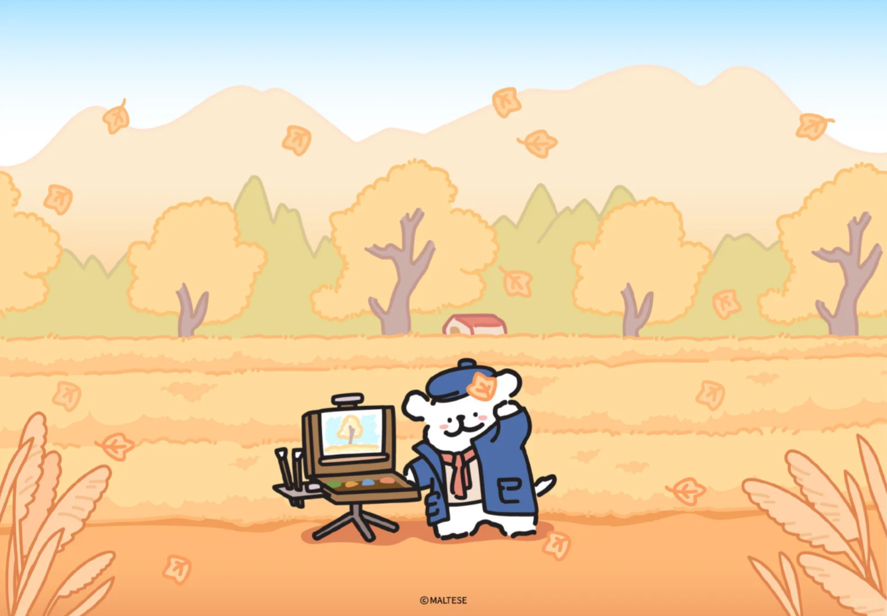

# 线条小狗桌面萌宠




一个基于 Electron 的桌面萌宠应用。线条小狗会悬浮在桌面上，可以拖拽移动、点击互动、调整大小，并支持通过命令触发任务完成动画。

**[下载 Windows 10 / 11 安装包（v1.0.3）](https://github.com/remake1026/desktop-pets/releases/download/v1.0.3/LineDog-1.0.3-Win10-11-Setup.exe)** · [版本说明](https://github.com/remake1026/desktop-pets/releases/tag/v1.0.3)

## 互动展示

从安静陪伴到鼠标互动，看看小狗的四种日常状态。

| 默认 | 鼠标悬停 | 鼠标点击 | 鼠标拖拽 |
| :---: | :---: | :---: | :---: |
|  |  |  |  |
| 不操作时，小狗安静地睡觉，陪伴在桌面上。 | 将鼠标移到小狗身上，小狗会跳跃回应；移开后恢复默认状态。 | 鼠标左键点击小狗，播放爱心动画；播放结束后恢复默认状态。 | 按住鼠标左键并移动，小狗切换为拖拽动画，跟随鼠标移动位置；松开后停在新位置。 |

## 功能

- 桌面悬浮：无边框、透明背景、置顶显示
- 原生 GIF 动画：睡觉、悬停、点击、拖拽、任务完成等状态
- 鼠标互动：悬停跳跃，点击出现爱心动画
- 拖拽移动：按住小狗即可移动位置
- 缩放调节：悬停后拖动右下角旋钮调整大小
- 快捷关闭：右键呼出关闭按钮
- 单实例运行：重复启动时复用已有窗口
- 开机自启动：安装时可选择登录 Windows 后自动启动
- 任务完成反馈：使用启动参数播放庆祝动画

## 技术栈

- Electron
- JavaScript
- HTML
- CSS
- Node.js / npm

## 小白安装教程

下面的步骤适合没有开发经验的 Windows 用户。

### 使用 Windows 安装包（无需安装 Node.js）

当前仅提供 Windows 10 / 11 安装包，已包含运行环境，无需安装 Node.js，安装时也无需联网下载依赖。

| 安装包 | 目标系统 | 架构 |
| --- | --- | --- |
| [下载 v1.0.3 安装包](https://github.com/remake1026/desktop-pets/releases/download/v1.0.3/LineDog-1.0.3-Win10-11-Setup.exe)（约 180 MB） | Windows 10、Windows 11 | 自动选择 x86 / x64 |

1. 点击上面的下载链接，保存 `LineDog-1.0.3-Win10-11-Setup.exe`。也可进入 [Releases 页面](https://github.com/remake1026/desktop-pets/releases/tag/v1.0.3)，在 **Assets** 中下载 `.exe` 安装包；`Source code` 是源码压缩包。
2. 如果旧版小狗正在运行，先右键小狗并点击“关闭萌宠”，再双击安装包。
3. 选择“仅为我安装”，点击“下一步”。需要为这台电脑的所有用户安装时，可选择“所有用户”。
4. 在“选定安装位置”页输入目录或点击“浏览”，可以选择其他磁盘，默认应用文件夹名为“线条小狗”。
5. 在“安装选项”页设置 **创建桌面快捷方式** 和 **开机自动启动**。两个选项默认勾选，不需要时可取消。
6. 点击“安装”。完成后保留“运行线条小狗”的勾选并点击“完成”，小狗就会出现在桌面上。以后可以从桌面快捷方式或开始菜单启动。

- 安装路径可以改为其他磁盘上的文件夹，支持中文路径。
- 默认安装文件夹和主程序名称为“线条小狗”，卸载程序为“卸载线条小狗.exe”。
- “创建桌面快捷方式”和“开机自动启动”均默认勾选，可在安装时取消；自启动会在登录 Windows 后启动小狗，卸载时清理对应设置。
- 默认仅为当前用户安装；也可以选择为所有用户安装，此时可能需要管理员授权。
- 卸载时，在 Windows 的应用列表中找到“线条小狗”即可。

当前已在 Windows 10 上进行程序运行测试，Windows 11 尚未完成实机验证；暂不提供其他 Windows 版本或原生 ARM64 安装包。安装包尚未进行代码签名，Windows 可能显示“未知发布者”。

### 源码运行方式一：启动脚本

下面的方式适合需要从源码运行的用户，需先安装 Node.js；使用上面的安装包可以跳过本节。

1. 下载或克隆本项目到电脑本地。
2. 确认电脑已经安装 Node.js。
3. 双击项目根目录下的 `启动桌宠.cmd`。
4. 第一次运行时，脚本会自动安装依赖，等待命令窗口安装完成即可。
5. 安装完成后，线条小狗会自动出现在桌面右下角附近。

如果双击后窗口一闪而过，通常是没有安装 Node.js，或者 npm 命令不可用。请先安装 Node.js，然后重新打开脚本。

### 源码运行方式二：命令行

如果你想看到更清楚的安装过程，可以按下面步骤操作。

1. 在项目文件夹空白处按住 `Shift`，点击鼠标右键。
2. 选择“在终端中打开”或“在 PowerShell 中打开”。
3. 进入源码目录：

```powershell
cd 源码
```

4. 安装依赖：

```powershell
npm install
```

5. 启动桌宠：

```powershell
npm start
```

### 触发任务完成动画

安装版可以在 PowerShell 中执行以下命令，将路径替换为实际安装目录：

```powershell
& "D:\线条小狗\线条小狗.exe" --task-complete
```

如果是从源码运行，可以在 `源码` 目录执行：

```powershell
npm run task-complete
```

桌宠会播放任务完成反馈动画。

## 使用方法

- 默认状态：小狗安静地睡觉，陪伴在桌面上
- 鼠标移到小狗身上：小狗会跳跃
- 鼠标左键点击小狗：播放爱心互动动画
- 按住小狗拖动：移动桌宠位置
- 鼠标移到小狗附近：右下角会出现缩放旋钮，拖动可调整大小
- 鼠标右键点击小狗：显示关闭按钮
- 开机自动启动：安装时勾选后，登录 Windows 即可自动启动；需要修改时可重新运行安装包，在“安装选项”页调整
- 卸载：在 Windows 的应用列表中卸载“线条小狗”，或运行安装目录中的“卸载线条小狗.exe”；卸载会清理该安装对应的自启动项

## 常见问题

### 提示 npm 不是内部或外部命令

说明电脑还没有安装 Node.js，或者安装后没有重启终端。

处理方法：

1. 安装 Node.js。
2. 关闭当前 PowerShell 或命令窗口。
3. 重新打开窗口，再运行 `启动桌宠.cmd` 或 `npm install`。

### 第一次启动很慢

从源码首次运行时需要下载 Electron 依赖，耗时和网络有关。安装包已包含运行环境，无需这一步。

### 桌宠没有出现

可以尝试：

- 查看任务栏或后台是否已经运行了一个实例
- 重新双击 `启动桌宠.cmd`
- 在 `源码` 目录运行 `npm start`，查看命令行是否有报错

### 怎么关闭桌宠

右键点击小狗，出现关闭按钮后点击即可关闭。

## 目录结构

```text
.
├── 启动桌宠.cmd
├── heart.gif
├── jump.gif
├── sleep.gif
├── special.gif
├── usageOver3Hours.gif
├── docs/
│   └── images/
│       ├── readme-hero.png
│       └── readme-autumn.png
├── 快捷方式图标/
└── 源码/
    ├── assets/
    ├── installer-resources/
    ├── index.html
    ├── main.js
    ├── package.json
    ├── pet.js
    ├── preload.js
    └── styles.css
```

## 开发说明

### 构建 Windows 安装包

在 Windows 开发电脑的 `源码` 目录中执行：

```powershell
npm ci
npm run dist:win
```

安装包输出到项目根目录的 `dist/standard/`，包含 32 位和 64 位程序，安装器按系统架构自动选择。

安装器使用 NSIS 中文向导和微软雅黑 UI 字体，启用高 DPI 支持、自选安装目录、桌面快捷方式、开始菜单入口和卸载功能。试用安装包尚未进行代码签名。

### 源码结构

主进程逻辑位于 `源码/main.js`，负责创建透明置顶窗口、处理窗口移动和缩放。

桌宠交互逻辑位于 `源码/pet.js`，负责切换不同 GIF 状态、处理鼠标悬停、点击、拖拽、关闭和任务完成反馈。

界面结构和样式分别位于 `源码/index.html` 与 `源码/styles.css`。

## Git 忽略

仓库已忽略 `node_modules/`、构建产物、日志、缓存、编辑器配置和系统文件。提交代码时保留源码、资源文件、`package.json` 与 `package-lock.json` 即可。
